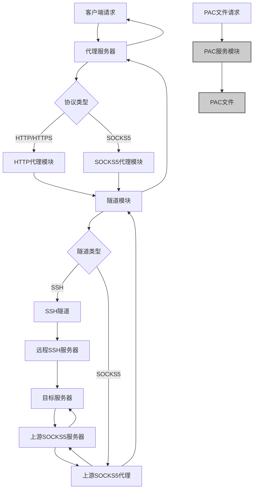

# Node.js SSH隧道代理服务器设计文档

## 1. 概述

本项目旨在实现一个基于Node.js的高性能代理服务器，通过SSH隧道技术实现安全的网络代理功能。该代理服务器支持HTTP、HTTPS和SOCKS5三种主流代理协议，并提供PAC文件服务，方便浏览器自动配置代理设置。

### 1.1 核心功能
- 基于SSH隧道的安全代理连接
- 支持HTTP/HTTPS代理协议
- 支持SOCKS5代理协议
- PAC文件服务，支持自动代理配置
- 高性能并发处理能力
- 支持上游SOCKS5代理（带认证）作为替代ssh隧道
- 网络连接池优化，降低网络开销引起的延迟
- 多线程支持，提升代理服务器性能和速度

### 1.2 技术栈
- Node.js运行时环境 (ES Modules)
- ssh2库用于建立SSH隧道
- Express.js用于HTTP服务和PAC文件服务
- socks库用于SOCKS5协议实现
- 相关代理协议实现库
- Commander.js用于命令行接口
- Worker Threads用于多线程处理（Node.js版本支持时）
- npm用于包管理和发布
- Vite用于构建工具

## 2. 系统架构



### 2.1 架构组件说明

1. **协议处理层**：识别并分发不同类型的代理请求
2. **代理核心模块**：实现HTTP、HTTPS、SOCKS5协议的具体处理逻辑
3. **隧道模块**：建立和管理SSH连接或上游SOCKS5代理连接，转发网络请求
4. **PAC服务模块**：提供PAC文件服务，支持浏览器自动代理配置
5. **配置管理模块**：管理系统配置和用户设置

### 2.2 技术选选型说明

- **ssh2库**：Node.js中用于SSH连接的成熟库，支持SSH隧道功能
- **socks库**：用于实现SOCKS5协议的Node.js库，支持客户端和服务端
- **Express.js**：轻量级Web框架，用于提供PAC文件服务
- **http/https模块**：Node.js内置模块，用于处理HTTP/HTTPS代理请求

## 3. API端点参考

### 3.1 PAC文件服务端点
- `GET /proxy.pac` - 获取PAC文件
- `GET /pac/:name` - 获取指定名称的PAC文件

### 3.2 管理端点（可选）
- `POST /api/config` - 更新代理配置
- `GET /api/status` - 获取代理服务器状态

### 3.3 认证机制
管理端点默认启用Basic认证保护。如果未在配置文件中指定用户名和密码，系统将自动生成随机的管理凭证，并在启动时输出到日志中。

```
// 自动生成的管理凭证示例
Username: admin_generated_8f3b2d1a
Password: secure_password_4k9m2n7x
```

建议在生产环境中手动配置管理端点的用户名和密码，以确保安全性。

### 3.3 请求/响应模式

#### PAC文件请求
```
Request:
GET /proxy.pac HTTP/1.1
Host: localhost:8080

Response:
HTTP/1.1 200 OK
Content-Type: application/x-ns-proxy-autoconfig
Content-Length: [length]

function FindProxyForURL(url, host) {
  return "SOCKS5 127.0.0.1:1080; SOCKS 127.0.0.1:1080; DIRECT";
}
```

### 3.4 认证要求
- SSH连接认证：支持用户名/密码或私钥认证
- 代理认证（可选）：支持Basic认证或无认证
- PAC服务：无需认证

## 4. 数据模型

### 4.1 配置模型
```javascript
{
  // SSH连接配置
  ssh: {
    host: string,
    port: number,
    username: string,
    password: string, // 或使用私钥认证
    privateKey: string,
    passphrase: string, // 私钥密码（如果需要）
    keepaliveInterval: number, // 心跳间隔
    retryAttempts: number,     // SSH重试次数
    retryDelay: number         // SSH重试延迟（毫秒）
  },
  
  // 上游SOCKS5代理配置（可选，替代SSH隧道）
  upstreamSocks5: {
    host: string,
    port: number,
    username: string, // 可选，如果上游SOCKS5需要认证
    password: string  // 可选，如果上游SOCKS5需要认证
  },
  
  // 连接池配置
  connectionPool: {
    maxSize: number,     // 连接池最大连接数
    minSize: number,     // 连接池最小连接数
    acquireTimeout: number,  // 获取连接超时时间（毫秒）
    idleTimeout: number,     // 空闲连接超时时间（毫秒）
    retryAttempts: number,   // 重试次数
    retryDelay: number       // 重试延迟（毫秒）
  },
  
  // 代理服务配置
  proxy: {
    httpPort: number,
    socksPort: number,
    pacPort: number // 仅在pac.enabled为true时生效
  },
  
  // PAC配置
  pac: {
    enabled: boolean, // 默认false，手动设置为true开启PAC服务
    filePath: string,
    content: string,
    defaultProxy: string // 默认代理设置
  },
  
  // 认证配置
  auth: {
    enabled: boolean,
    username: string,
    password: string
  },
  
  // 管理端点配置
  admin: {
    enabled: boolean, // 默认false，手动设置为true开启管理端点服务
    username: string, // 如果未指定，将自动生成
    password: string  // 如果未指定，将自动生成
  }
}
```

### 4.2 连接状态模型
```javascript
{
  sshConnected: boolean,
  activeConnections: number,
  totalConnections: number,
  lastError: string,
  uptime: number
}
```

## 5. 业务逻辑层

### 5.1 隧道管理
- 建立SSH连接：使用ssh2库建立到远程服务器的安全连接
- 建立上游SOCKS5连接：连接到需要认证的上游SOCKS5代理
- 维持隧道连接状态：监控连接状态，处理断线重连
- 处理连接异常和重连机制：实现指数退卑重连策略
- SSH隧道重试机制：当SSH隧道因未知原因中断时，自动重试确保连接正常
- 连接池管理：维护多个隧道连接以提高性能，降低网络开销引起的延迟
- 支持动态切换隧道类型：根据配置选择使用SSH隧道或上游SOCKS5代理
- 连接预初始化：代理创建后立即基于连接池配置初始化网络连接，降低网络开销

### 5.6 多线程支持
- Worker Threads检测：检测Node.js版本是否支持Worker Threads
- 多线程处理：在支持的环境中使用多线程处理高CPU消耗任务
- 线程池管理：维护线程池以减少线程创建开销
- 数据传输优化：优化主线程与工作线程间的数据传输

### 5.7 连接预初始化
- 启动时连接初始化：代理启动时根据连接池配置预建立网络连接
- 连接池预热：在代理服务启动后立即初始化指定数量的连接
- 资源预分配：提前分配网络资源，降低首次请求的延迟
- 异步初始化：使用异步方式初始化连接，避免阻塞主线程

### 5.5 管理端点服务
- API端点管理：提供配置更新和状态查询接口
- 认证保护：默认启用Basic认证保护
- 服务开关控制：根据配置决定是否启动管理端点服务（默认不开启）
- 自动生成凭证：未配置时自动生成管理凭证

### 5.2 HTTP/HTTPS代理处理
- 解析HTTP请求：解析客户端发送的HTTP请求头和内容
- 通过SSH隧道转发请求：将请求通过SSH隧道发送到目标服务器
- 处理HTTPS CONNECT方法：支持HTTPS隧道建立
- 响应客户端请求：将目标服务器的响应返回给客户端
- 支持HTTP/1.1持久连接：提高代理性能

### 5.3 SOCKS5代理处理
- SOCKS5协议握手：实现SOCKS5协议的认证和连接建立过程
- 处理客户端请求：解析SOCKS5客户端请求
- 通过SSH隧道转发数据：将数据通过SSH隧道转发
- 支持用户名/密码认证（可选）：提供可选的代理认证机制
- 支持IPv4/IPv6和域名解析：处理不同类型的地址格式

### 5.4 PAC文件服务
- 生成动态PAC文件内容：根据配置动态生成PAC文件
- 提供静态PAC文件服务：支持从文件系统加载PAC文件
- 支持多PAC文件配置：支持根据客户端请求提供不同的PAC文件
- MIME类型设置：正确设置PAC文件的Content-Type头部
- 服务开关控制：根据配置决定是否启动PAC服务（默认不开启）

## 6. 中间件设计

### 6.1 认证中间件
- 客户端认证（可选）：支持Basic认证或自定义认证机制
- SSH服务器认证：支持密码认证和公钥认证
- 证书验证：验证SSH服务器证书（可选）

### 6.2 日志中间件
- 记录代理请求日志：记录请求类型、目标地址、响应状态等
- 记录SSH连接状态：记录连接建立、断开、错误等事件
- 错误日志处理：记录和分类不同类型的错误
- 性能日志：记录请求处理时间、数据传输量等性能指标

### 6.3 限流中间件（可选）
- 防止滥用：限制单个IP或用户的请求频率
- 控制并发连接数：限制同时处理的连接数
- 带宽限制：控制数据传输速率（可选）
- 连接队列管理：处理突发连接请求

### 6.4 安全中间件
- 请求过滤：防止恶意请求
- 数据加密：确保传输数据安全
- 访问控制：基于IP或用户的访问控制

## 7. 测试策略

### 7.1 单元测试
- SSH隧道连接测试：验证SSH连接建立和数据传输
- HTTP代理功能测试：测试HTTP/HTTPS请求代理功能
- SOCKS5代理功能测试：验证SOCKS5协议握手和数据转发
- PAC文件生成测试：验证PAC文件内容正确性
- 配置管理测试：测试配置加载、更新和验证
- SSH重试机制测试：验证SSH连接断开时的重试机制
- 连接池配置测试：验证连接池配置参数的正确应用
- 连接预初始化测试：验证代理启动时连接池的正确初始化

### 7.2 集成测试
- 完整代理流程测试：端到端代理功能测试
- 不同协议支持测试：验证HTTP、HTTPS、SOCKS5协议支持
- 异常处理测试：测试网络异常、SSH断连等情况的处理
- 认证功能测试：测试各种认证机制
- 多客户端并发测试：验证多客户端同时连接的稳定性
- SSH重试机制测试：验证SSH连接中断后的自动重连功能
- 连接池性能测试：验证连接池在高并发下的性能表现

### 7.3 性能测试
- 并发连接测试：测试同时处理多个连接的能力
- 数据传输性能测试：测量代理服务器的数据传输速率
- SSH隧道稳定性测试：长时间运行稳定性测试
- 资源使用测试：监控内存、CPU使用情况
- 压力测试：高负载情况下的性能表现
- 连接池性能测试：验证连接池对性能的提升效果
- 多线程性能测试：验证多线程对性能的提升效果
- 连接预初始化性能测试：验证连接预初始化对首次请求延迟的改善效果

### 7.4 测试工具和环境
- Mocha/Chai用于单元测试
- Supertest用于HTTP接口测试
- 模拟SSH服务器用于测试环境
- 性能测试工具如Apache Bench或Artillery

## 8. 部署和监控

### 8.1 部署方案
- Docker容器化部署
- systemd服务部署（Linux）
- Windows服务部署（可选）

### 8.2 监控和日志
- 实时连接数监控
- 数据传输量统计
- 错误率监控
- 日志轮转和归档

### 8.3 安全考虑
- 定期更新依赖库
- SSH密钥安全管理
- 访问日志审计
- 防火墙规则配置

## 9. 项目结构和依赖

### 9.1 项目目录结构
```
src/
├── config/              # 配置文件
│   └── default.config.mjs  # 默认配置
├── core/                # 核心模块
│   ├── ssh-tunnel.mjs   # SSH隧道管理
│   ├── http-proxy.mjs   # HTTP代理实现
│   ├── socks-proxy.mjs  # SOCKS5代理实现
│   ├── pac-service.mjs  # PAC文件服务
│   ├── connection-pool.mjs # 连接池管理
│   ├── connection-initializer.mjs # 连接预初始化
│   └── worker-manager.mjs  # 多线程管理
├── middleware/          # 中间件
│   ├── auth.mjs         # 认证中间件
│   ├── logger.mjs       # 日志中间件
│   └── rate-limit.mjs   # 限流中间件
├── utils/               # 工具函数
│   └── helpers.mjs      # 辅助函数
├── cli/                 # 命令行接口
│   └── cli.mjs          # CLI入口
├── tests/               # 测试文件
├── index.mjs            # 模块入口文件
└── app.mjs              # 应用主文件

dist/                    # 构建输出目录
├── config/
├── core/
├── middleware/
├── utils/
├── cli/
├── index.js
└── app.js

vite.config.js          # Vite配置文件
```

### 9.2 核心依赖包
- `ssh2`: SSH客户端和服务端模块
- `socks`: SOCKS(v4/v5)代理客户端和服务端
- `express`: Web应用框架
- `cors`: 跨域资源共享中间件
- `helmet`: 安全头部设置
- `winston`: 日志记录
- `dotenv`: 环境变量配置
- `worker_threads`: Node.js内置模块，用于多线程处理

### 9.3 构建和发布
- 使用npm进行包管理和发布
- 支持通过npm仓库安装和使用
- 构建脚本自动化处理代码打包和发布流程

## 12. 构建和发布流程

### 12.1 构建脚本
- `npm run build`: 执行代码构建，包括代码检查、测试和打包
- `npm run lint`: 代码风格检查
- `npm test`: 运行测试套件
- `npm run prepublish`: 发布前的准备工作
- 使用Vite进行代码构建和打包

### 12.2 发布到npm仓库
- 自动化发布流程，确保代码质量和版本一致性
- 语义化版本控制，遵循SemVer规范
- 发布前自动运行测试和代码检查
- 支持npm官方仓库和私有仓库发布

### 12.3 package.json配置
```json
{
  "name": "ssh2proxy",
  "version": "1.0.0",
  "description": "高性能SSH隧道代理服务器，支持HTTP、HTTPS、SOCKS5代理",
  "main": "dist/index.js",
  "bin": {
    "ssh2proxy": "dist/cli/cli.js"
  },
  "files": [
    "dist/",
    "README.md",
    "LICENSE"
  ],
  "scripts": {
    "build": "npm run clean && npm run lint && npm run test && vite build",
    "dev": "vite",
    "lint": "eslint src/",
    "test": "mocha tests/",
    "clean": "rimraf dist/",
    "prepublishOnly": "npm run build"
  },
  "keywords": [
    "proxy",
    "ssh",
    "socks5",
    "http",
    "https",
    "tunnel"
  ],
  "author": "Your Name",
  "license": "MIT",
  "repository": {
    "type": "git",
    "url": "https://github.com/yourusername/ssh2proxy.git"
  },
  "bugs": {
    "url": "https://github.com/yourusername/ssh2proxy/issues"
  },
  "homepage": "https://github.com/yourusername/ssh2proxy#readme",
  "devDependencies": {
    "vite": "^4.0.0"
  }
}
```

### 12.4 Vite配置文件
```javascript
// vite.config.js
import { defineConfig } from 'vite';

export default defineConfig({
  build: {
    outDir: 'dist',
    lib: {
      entry: 'src/index.mjs',
      name: 'ssh2proxy',
      fileName: (format) => `index.${format}.js`,
      formats: ['es', 'cjs']
    },
    rollupOptions: {
      external: ['ssh2', 'socks', 'express', 'worker_threads'],
      output: {
        entryFileNames: '[name].js',
        chunkFileNames: '[name].js',
        assetFileNames: '[name].[ext]'
      }
    }
  },
  resolve: {
    extensions: ['.mjs', '.js']
  }
});
```

### 12.4 第三方使用方式
```bash
# 安装包
npm install ssh2proxy

# 作为模块使用
import { ProxyServer } from 'ssh2proxy';

# 命令行使用
npx ssh2proxy --help
```

### 9.3 开发依赖包
- `mocha`: 测试框架
- `chai`: 断言库
- `supertest`: HTTP测试工具
- `nodemon`: 开发环境自动重启
- `eslint`: 代码风格检查
- `rimraf`: 删除文件和目录
- `cross-env`: 跨平台环境变量设置
- `vite`: 构建工具
- `@vitejs/plugin-node`: Vite Node.js插件

## 10. 命令行接口设计

### 10.1 CLI命令
```
# 启动代理服务器
npm start

# 或者直接运行
node src/cli/cli.mjs

# 带参数启动
node src/cli/cli.mjs --config config.json --port 8080

# 显示帮助信息
node src/cli/cli.mjs --help

# 显示版本信息
node src/cli/cli.mjs --version
```

### 10.2 CLI参数选项
- `-c, --config <path>`: 指定配置文件路径
- `-p, --port <port>`: 指定代理服务端口
- `-h, --host <host>`: 指定监听主机地址
- `-v, --verbose`: 启用详细日志输出
- `--ssh-host <host>`: SSH服务器主机地址
- `--ssh-port <port>`: SSH服务器端口
- `--enable-pac`: 启用PAC文件服务（默认不开启）
- `--enable-admin`: 启用管理端点服务（默认不开启）
- `--upstream-socks5-host <host>`: 上游SOCKS5代理主机地址
- `--upstream-socks5-port <port>`: 上游SOCKS5代理端口
- `--upstream-socks5-user <username>`: 上游SOCKS5代理用户名
- `--upstream-socks5-pass <password>`: 上游SOCKS5代理密码
- `--pool-max-size <number>`: 连接池最大连接数
- `--pool-min-size <number>`: 连接池最小连接数
- `--pool-acquire-timeout <number>`: 获取连接超时时间（毫秒）
- `--pool-idle-timeout <number>`: 空闲连接超时时间（毫秒）

## 11. 模块化使用

### 11.1 作为模块引入
```javascript
import { ProxyServer } from 'ssh2proxy';

// 使用SSH隧道的配置示例（默认不开启PAC和管理端点）
const proxyWithSSH = new ProxyServer({
  ssh: {
    host: 'remote-server.com',
    port: 22,
    username: 'user',
    password: 'password',
    retryAttempts: 5,      // SSH连接失败时重试5次
    retryDelay: 2000       // 每次重试间隔2秒
  },
  proxy: {
    httpPort: 8080,
    socksPort: 1080
  },
  connectionPool: {
    maxSize: 20,           // 最大连接数20
    minSize: 5,            // 最小连接数5
    acquireTimeout: 30000, // 获取连接超时30秒
    idleTimeout: 600000,   // 空闲连接10分钟后超时
    retryAttempts: 3,      // 连接池操作重试3次
    retryDelay: 1000       // 每次重试间隔1秒
  }
});

// 启用PAC和管理端点的配置示例
const proxyWithAllServices = new ProxyServer({
  ssh: {
    host: 'remote-server.com',
    port: 22,
    username: 'user',
    password: 'password'
  },
  proxy: {
    httpPort: 8080,
    socksPort: 1080,
    pacPort: 8090
  },
  pac: {
    enabled: true,
    content: 'function FindProxyForURL(url, host) { return "SOCKS5 127.0.0.1:1080; DIRECT"; }'
  },
  admin: {
    enabled: true,
    username: 'admin',
    password: 'secure_password'
  }
});

// 使用上游SOCKS5代理的配置示例
const proxyWithUpstreamSocks5 = new ProxyServer({
  upstreamSocks5: {
    host: 'upstream-proxy.com',
    port: 1080,
    username: 'upstream_user',
    password: 'upstream_password'
  },
  proxy: {
    httpPort: 8080,
    socksPort: 1080
  }
});

// 启动代理服务器
// 在start()调用时，将基于连接池配置预初始化网络连接
await proxyWithSSH.start(); // 或 await proxyWithUpstreamSocks5.start();

// 停止代理服务器
await proxyWithSSH.stop(); // 或 await proxyWithUpstreamSocks5.stop();
```

### 11.2 模块API接口
- `ProxyServer(config)`: 构造函数，接受配置对象
- `proxy.start()`: 启动代理服务
- `proxy.stop()`: 停止代理服务
- `proxy.getStatus()`: 获取服务状态
- `proxy.updateConfig(newConfig)`: 更新配置
