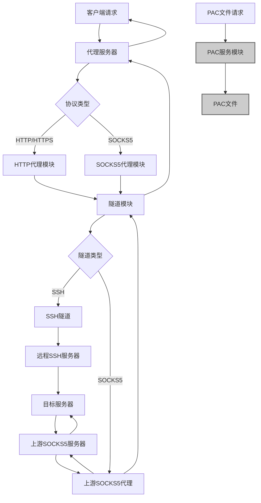

# Node.js SSH隧道代理服务器设计文档

## 1. 概述

本项目旨在实现一个基于Node.js的高性能代理服务器，通过SSH隧道技术实现安全的网络代理功能。该代理服务器支持HTTP、HTTPS和SOCKS5三种主流代理协议，并提供PAC文件服务，方便浏览器自动配置代理设置。

### 1.1 核心功能
- 基于SSH隧道的安全代理连接
- 支持HTTP/HTTPS代理协议（`proxy.httpsPort` 为独立的 HTTP CONNECT 监听端口，不做 TLS 终止）
- 支持SOCKS5代理协议（按 ATYP 分流 IPv4/域名/IPv6 目标）
- PAC文件服务，支持自动代理配置，并支持多份按名装载的 PAC（`pac.directory` / `pac.files`）
- 支持上游SOCKS5代理（带认证）作为替代ssh隧道
- 网络连接池优化，降低网络开销引起的延迟
- 多线程支持：`node:worker_threads` 真实 worker 池（PAC 渲染热路径），容量键 `proxy.workerPoolSize`（默认 `2`）

### 1.2 技术栈
- Node.js运行时环境 (ES Modules)
- ssh2库用于建立SSH隧道
- Express.js用于HTTP服务和PAC文件服务
- socks库用于SOCKS5协议实现
- 相关代理协议实现库
- Commander.js用于命令行接口
- Worker Threads（`node:worker_threads`）用于多线程处理：真实 worker 池 + 主线程降级
- npm用于包管理和发布
- Vite用于构建工具

## 2. 系统架构


```mermaid
graph TD
    A[客户端请求] --> B[代理服务器]
    B --> C{协议类型}
    C -->|HTTP/HTTPS| D[HTTP代理模块]
    C -->|SOCKS5| E[SOCKS5代理模块]
    D --> F[隧道模块]
    E --> F
    F --> G{隧道类型}
    G -->|SSH| H[SSH隧道]
    G -->|SOCKS5| I[上游SOCKS5代理]
    H --> J[远程SSH服务器]
    I --> K[上游SOCKS5服务器]
    J --> L[目标服务器]
    K --> L
    L --> K
    K --> I
    I --> F
    F --> B
    B --> A
    
    M[PAC文件请求] --> N[PAC服务模块]
    N --> O[PAC文件]
    
    style N fill:#cccccc,stroke:#666,stroke-width:2px
    style O fill:#cccccc,stroke:#666,stroke-width:2px
```

### 2.1 架构组件说明

1. **协议处理层**：识别并分发不同类型的代理请求
2. **代理核心模块**：实现HTTP、HTTPS、SOCKS5协议的具体处理逻辑
3. **隧道模块**：建立和管理SSH连接或上游SOCKS5代理连接，转发网络请求
4. **PAC服务模块**：提供PAC文件服务，支持浏览器自动代理配置
5. **配置管理模块**：管理系统配置和用户设置

### 2.2 技术选选型说明

- **ssh2库**：Node.js中用于SSH连接的成熟库，支持SSH隧道功能
- **socks库**：用于实现SOCKS5协议的Node.js库，支持客户端和服务端
- **Express.js**：轻量级Web框架，用于提供PAC文件服务
- **http/https模块**：Node.js内置模块，用于处理HTTP/HTTPS代理请求

## 3. API端点参考

### 3.1 PAC文件服务端点
- `GET /proxy.pac` - 获取PAC文件
- `GET /pac/:name` - 获取指定名称的PAC文件

### 3.2 管理端点（可选）
- `POST /api/config` - 更新代理配置（深合并进运行配置，回显脱敏后的配置与校验结果）
- `GET /api/status` - 获取代理服务器状态（取自连接池 `getStatus()`，非池上不存在的字段）
- 未开启（`admin.enabled` 为 false，默认）时不监听；开启但 `proxy.adminPort` 缺键时**不监听**并打印告警（无端口兜底）
- `/api/*` 由 Basic 认证保护，校验失败回 `401` + `WWW-Authenticate`

### 3.3 认证机制
管理端点默认启用Basic认证保护。如果未在配置文件中指定用户名和密码，系统将自动生成随机的管理凭证，并在启动时输出到日志中。

```
// 自动生成的管理凭证示例（用户名 admin_generated_ + 8 位十六进制；口令为 20 位十六进制）
Username: admin_generated_8f3b2d1a
Password: 9f4c2a7d1b8e3506c9af
```

凭证由 `crypto.randomBytes()` 生成并转成十六进制字符串（`AuthMiddleware#generateAdminCredentials()` 与 `#generateRandomPassword()`，见 `src/middleware/auth.mjs`），因此形如 `secure_password_…` 的示例形态不可能是实现的真实输出。校验为恒定时间比较（HMAC-SHA256 归一 + `timingSafeEqual`）。

建议在生产环境中手动配置管理端点的用户名和密码，以确保安全性。

### 3.4 请求/响应模式

#### PAC文件请求
```
Request:
GET /proxy.pac HTTP/1.1
Host: localhost:8080

Response:
HTTP/1.1 200 OK
Content-Type: application/x-ns-proxy-autoconfig
Content-Length: [length]

function FindProxyForURL(url, host) {
  return "SOCKS5 127.0.0.1:1080; SOCKS 127.0.0.1:1080; DIRECT";
}
```

### 3.5 认证要求
- SSH连接认证：支持用户名/密码或私钥认证（缺失时仅告警，不阻断启动）
- 代理认证（可选）：`auth.enabled` 为 true 时 SOCKS5 走 RFC1929 用户名/口令、HTTP 侧走 Basic；为 false（默认）时 SOCKS5 协商「无认证」方法，即匿名入站
- PAC服务：无需认证（`/proxy.pac` 与 `/pac/:name` 不经过代理认证中间件）

## 4. 数据模型

### 4.1 配置模型
以下键集与 `src/config/default.config.mjs` 逐键对应（注释中的默认值即为该文件的取值）。

```javascript
{
  // 隧道类型（缺省为 ssh；不设置将始终走 SSH 隧道）
  tunnel: {
    type: 'ssh' // 或 'socks5'
  },

  // SSH连接配置
  ssh: {
    host: string,              // 'localhost'
    port: number,              // 22
    username: string,          // 'user'
    password: string,          // '' —— 或使用私钥认证
    privateKey: string,        // ''
    passphrase: string,        // 私钥密码（如果需要）
    keepaliveInterval: number, // 心跳间隔，30000
    retryAttempts: number,     // SSH重试次数，3
    retryDelay: number         // SSH重试延迟（毫秒），5000
  },

  // 上游SOCKS5代理配置（可选，替代SSH隧道）
  upstreamSocks5: {
    host: string,     // ''
    port: number,     // 1080
    username: string, // 可选，如果上游SOCKS5需要认证
    password: string, // 可选，如果上游SOCKS5需要认证
    pool: {           // 每个目标的 SOCKS5 连接池
      maxConnections: number,        // 10
      idleTimeout: number,           // 30000
      connectionTimeout: number,     // 10000
      healthCheckInterval: number,   // 60000
      waitTimeout: number,           // 池满后排队等待上限，10000
      cleanupInterval: number,       // 空闲回收扫描间隔，10000
      minConnections: number,        // 动态调整下限，1
      maxConnectionsLimit: number,   // 动态调整上限，0 表示 maxConnections * 4
      prewarm: boolean,              // false
      prewarmCount: number,          // 1
      prewarmTargets: array,         // []
      retryBackoffFactor: number,    // 2
      retryMaxDelay: number,         // 30000
      fallbackHost: string,          // ''（故障转移用备用上游）
      fallbackPort: number           // 0
    }
  },

  // 顶层兼容别名：与 upstreamSocks5.pool 同源，存在时优先生效
  socks5Pool: {},

  // 连接池配置
  connectionPool: {
    maxSize: number,             // 连接池最大连接数，10
    minSize: number,             // 连接池最小连接数，3
    acquireTimeout: number,      // 获取连接超时时间（毫秒），30000
    idleTimeout: number,         // 空闲连接超时时间（毫秒），60000
    retryAttempts: number,       // 重试次数，3（同时是 SOCKS5 建连重试的权威来源）
    retryDelay: number,          // 重试延迟（毫秒），5000
    maxConnectionsPerTunnel: number, // 每条 SSH 隧道最大连接数，10
    loadBalancingStrategy: string    // 'least-connections'
  },

  // 代理服务配置
  proxy: {
    httpPort: number,      // 8080
    socksPort: number,     // 1080
    pacPort: number,       // 8013，仅在 pac.enabled 为 true 时生效
    adminPort: number,     // 8081，仅在 admin.enabled 为 true 时生效（唯一来源，无端口兜底）
    httpsPort: number,     // 0，HTTPS(CONNECT) 独立监听端口；0/缺键不监听，不做 TLS 终止
    workerPoolSize: number // 2，Worker 池线程数（testingMode 下不启动）
  },

  // 测试模式：true 时不初始化连接池、不启动 Worker 池
  testingMode: boolean, // false

  // 限流配置（计数键 = 客户端 IP）
  rateLimit: {
    windowMs: number,   // 60000
    max: number,        // 100
    trustProxy: boolean // false，默认不采信 x-forwarded-for
  },

  // PAC配置
  pac: {
    enabled: boolean,  // 默认false，手动设置为true开启PAC服务
    filePath: string,  // ''
    content: string,   // ''
    directory: string, // ''，多PAC：按请求名从该目录装载
    files: object,     // {}，多PAC：显式映射 { '<请求名>': '<文件路径>' }，优先于 directory
    defaultProxy: string // 回环端口会按实际 proxy.socksPort 归一化
  },

  // 认证配置
  auth: {
    enabled: boolean,  // false；为 false 时 SOCKS5 协商匿名入站
    username: string,  // ''；与 password 均非空才算有效凭据
    password: string   // ''
  },

  // 管理端点配置
  admin: {
    enabled: boolean,  // 默认false，手动设置为true开启管理端点服务
    username: string,  // 如果未指定，将自动生成
    password: string   // 如果未指定，将自动生成
  }
}
```

### 4.2 连接状态模型

`LoadBalancedConnectionPool#getStatus()` 的真实返回（契约冻结字段 + 加法式附加字段）：

```javascript
{
  available: number,   // 空闲隧道数（池内 connectionCount === 0）
  used: number,        // 占用中的隧道数（connectionCount > 0）
  total: number,       // available + used
  maxSize: number,
  minSize: number,
  maxConnectionsPerTunnel: number,
  loadBalancingStrategy: string,
  waiting: number,     // 排队等待者数量（达 maxSize 时可观测）
  closed: boolean,     // 粘性关闭态
  usedDetails: [{ connectionCount: number }],
  stats: object        // 池内部计数器快照
}
```

SSH 连接状态另有出口：`ProxyServer.getStatus()`（`/api/status` 的数据源）的真实键集为 `sshConnected`、`activeConnections`、`totalConnections`、`availableConnections`、`available`、`used`、`total`、`poolStatus`、`workerPool`、`uptime`（**不含 `lastError`**，该字段未实现）。其中连接数取自池的 `getStatus()` 契约字段（`used`/`total`/`available`），而非已移除的 `usedConnections`。

## 5. 业务逻辑层

### 5.1 隧道管理
- 建立SSH连接：使用ssh2库建立到远程服务器的安全连接
- 建立上游SOCKS5连接：连接到需要认证的上游SOCKS5代理
- 维持隧道连接状态：监控连接状态，处理断线重连
- 处理连接异常和重连机制：实现指数退避重连策略（SOCKS5 建连重试的权威来源是 `connectionPool.retryAttempts`/`retryDelay`，退避倍数 `retryBackoffFactor`、上限 `retryMaxDelay`；SSH 侧同名键的内置默认定义在 `src/core/ssh-tunnel.mjs` 的 `DEFAULT_RETRY`）
- SSH隧道重试机制：当SSH隧道因未知原因中断时，自动重试确保连接正常
- 连接池管理：维护多个隧道连接以提高性能，降低网络开销引起的延迟（`LoadBalancedConnectionPool`，策略由 `connectionPool.loadBalancingStrategy` 分派：`least-connections` 比较 `connectionCount`、平手按 `lastUsed`；`round-robin` 按游标轮转；未识别值回落 `least-connections`）
- 支持动态切换隧道类型：根据配置 `tunnel.type`（`ssh` / `socks5`）选择使用SSH隧道或上游SOCKS5代理
- 连接预初始化：代理 `start()` 时基于连接池配置初始化网络连接（`ConnectionInitializer#initializeConnections()`），并按 `startMaintenance()` 维持

### 5.2 多线程支持
- 实现：`node:worker_threads` 真实 worker 池（`src/core/worker-manager.mjs`），非"检测到才启用"的条件分支；声明常量 `DEFAULT_POOL_SIZE = 2`（同文件 `WorkerManager`）
- 容量：`options.size` > `config.proxy.workerPoolSize` > 声明常量（`WorkerManager#constructor()`）
- 启动点：`ProxyServer.start()` → `startWorkerPool()`（均在 `src/app.mjs`；`testingMode` 为 true 时不启动）
- 真实消费点：PAC 渲染热路径 `renderPacViaWorker()` → `assignTask({ type: 'renderPac' })`；**端口/内容只有一个真源**——`PacService#resolvePacRender()` 先在主线程解析（命中文件/显式内容 → `content`；默认面 → `renderProxy` 代理串），payload 只携带解析结果；worker 侧 `renderPac()` 在 payload 无 `content`/`raw`/`renderProxy` 时**抛错，不再回落 1080**。按名未装载时 `resolvePacRender()` 返回 `null`（调用方 404，不冒充默认内容）；池不可用或结果不合规时回落主线程同一 handler 表，不阻断 PAC 服务
- 生命周期：`WorkerManager#start()` / `#close()` / 可观测 `#getStats()`（均在 `src/core/worker-manager.mjs`）
- 崩溃补位：单个 worker 崩溃后按索引在 25ms 内重启（`MAX_RESTARTS_PER_WORKER = 3`），补位后 `threadId` 会变化；超出上限则该索引保持 `dead` 且 `degraded = true`

### 5.3 连接预初始化
- 启动时连接初始化：代理启动时根据连接池配置预建立网络连接
- SOCKS5 连接池预热：`prewarm` 为 true 时在隧道 `connect()` 阶段按 `prewarmTargets`（上限受 `prewarmCount`/`maxConnections` 约束）建连；未配置目标时不建任何连接（避免误连任意地址）
- 资源预分配：提前分配网络资源，降低首次请求的延迟
- 异步初始化：使用异步方式初始化连接，避免阻塞主线程（`connect()` 返回预热连接数，是可观测返回值）

### 5.4 管理端点服务
- API端点管理：`GET /api/status` 与 `POST /api/config`（真读写运行配置，回显脱敏；路由注册见 `ProxyServer#registerAdminRoutes()`，脱敏回显见 `ProxyServer#describeConfig()`，均在 `src/app.mjs`）
- 认证保护：`/api/*` 使用 Basic 认证（恒定时间比较，`ProxyServer#validateAuth()` 与 `#registerAdminRoutes()`，`src/app.mjs`）
- 服务开关控制：`admin.enabled` 决定是否启动（默认不开启；`ProxyServer#startAdminService()`）
- 端口来源：`proxy.adminPort`（默认 8081）是唯一来源，缺键时不监听并打印告警（`ProxyServer#startAdminService()`）
- 自动生成凭证：未配置时自动生成管理凭证并在启动日志打印（`ProxyServer#getAdminCredentials()` 与 `AuthMiddleware#generateAdminCredentials()`，与 `/api/*` 校验值同源）

### 5.5 HTTP/HTTPS代理处理
- 解析HTTP请求：解析客户端发送的HTTP请求头和内容
- 转发请求：经隧道抽象（SSH 或上游 SOCKS5）`forwardOut()` 发到目标服务器
- 处理HTTPS CONNECT方法：支持 CONNECT 隧道建立（`server.on('connect')`）
- 响应客户端请求：将目标服务器的响应返回给客户端
- `auth.enabled` 为 true 时先做代理认证，失败回 `407`

### 5.6 SOCKS5代理处理
- SOCKS5协议握手：按声明长度增量读取实现协商与连接建立（可处理同段 TCP 粘连）
- 处理客户端请求：解析 SOCKS5 客户端请求
- 按 ATYP 分流：`0x01` IPv4、`0x03` 域名、`0x04` IPv6；不改写地址，未知 ATYP 回 `0x08`
- 认证语义：`auth.enabled` 为 false（默认）= 协商「无认证」的匿名入站（不是「认证成功」）；为 true 时走 RFC1929，且用户名与口令**均非空**才算有效凭据，否则 fail-closed 拒绝一切认证并告警
- 限流粒度：计数键只含客户端 IP

### 5.7 PAC文件服务
- 生成动态PAC文件内容：由 `PacService#generateDefaultProxyString()` 统一生成，回环端口按实际 `proxy.socksPort` 归一化（`{socksPort}`/`{httpPort}`/`{host}` 占位符与历史 `127.0.0.1:<端口>` 一并替换）
- 提供静态PAC文件服务：支持从文件系统加载PAC文件（`pac.filePath`）
- 支持多PAC文件配置：`pac.files` 显式映射与 `pac.directory` 目录装载（`PacService#resolvePacFile()`）；按名未命中返回 **404**（`PacService#handleRequest()`），绝不用默认内容冒充
- worker 热路径同源：`PacService#resolvePacRender()` 在主线程解析后下发 payload，worker 不自行推断端口
- 路由：`/proxy.pac` 与 `/pac/:name`（`src/app.mjs` 的 `startPacService()`）
- MIME类型设置：`application/x-ns-proxy-autoconfig`
- 服务开关控制：`pac.enabled` 决定是否启动PAC服务（默认不开启）

## 6. 中间件设计

### 6.1 认证中间件
- 客户端认证（可选）：HTTP Basic（`AuthMiddleware#basicAuth`，恒定时间比较）
- 有效凭据判据：用户名与口令均非空；配置无效时拒绝一切（fail-closed），不 fail-open
- SSH服务器认证：支持密码认证和公钥认证（由 ssh2 隧道实现负责，凭据缺失只告警不阻断启动）
- 证书验证：当前实现未提供主机密钥/证书校验开关（未实现，不作为声称）

### 6.2 日志中间件
- 记录代理请求日志：记录请求类型、目标地址、响应状态等
- 日志级别：`config.logging.level` 优先，其次 `-v/--verbose`（debug），缺省 info
- 记录SSH连接状态：记录连接建立、断开、错误等事件
- 错误日志处理：记录和分类不同类型的错误

### 6.3 限流中间件
- 防止滥用：固定窗口限制每个客户端 IP 的请求频率（`windowMs` 默认 60000，`max` 默认 100）
- 键粒度：只含客户端 IP，换 URL 或换方法不会重置窗口
- 代理头：`x-forwarded-for` 默认不采信，仅 `trustProxy: true` 时取
- 边界：`windowMs <= 0` 表示不限流；`max <= 0` 表示全部拒绝
- 未实现项（不作为声称）：并发连接数上限、带宽限制、连接队列管理

### 6.4 安全中间件
- 安全头部与跨域：PAC/管理 Express 应用挂载 `helmet()` 与 `cors()`
- 代理认证中间件挂载范围：仅 HTTP 代理面（`/api/*`、`/proxy.pac`、`/pac/*` 不经代理认证，避免与 PAC/管理探测相互干扰）
- 未实现项（不作为声称）：基于 IP/用户的访问控制白名单、传输层加密（除 SSH 隧道自带的加密外不额外加密）、请求过滤规则

## 7. 测试策略

### 7.1 单元测试
- SOCKS5 隧道与连接池：`Socks5Tunnel` 的 `connect()`/`forwardOut()`/`getPoolStats()`/`close()` 契约（`src/tests/socks-tunnel.test.mjs`，建连经 `poolConfig.createConnection` 注入 stub）
- 负载均衡连接池：`acquire()`/`release()` 记账、`maxSize` 上限与 `POOL_AT_CAPACITY`、`connectionCount` 最少连接、`close()` 关闭态与 `POOL_CLOSED`（`src/tests/load-balanced-connection-pool.test.mjs`）
- HTTP 代理与配置：请求行/`Host` 构造契约、`mergeConfig`、`validateConfig`、`applyCliOptions` 选项→配置键映射与非法端口拒绝（`src/tests/proxy.test.mjs`）
- PAC 文件生成：默认内容与按名装载、未命中 404 语义

### 7.2 集成测试
- `src/tests/integration/socks5-tunnel.integration.test.mjs`：真实 `ProxyServer` + 真实 HTTP 处理链 + 本地上游的真实 TCP 往返（请求行与 `Host` 校验、上游响应透传）
- 真实连接池 `acquire()`/`release()` 记账与 `forwardOut()` 目标正确性
- **负向对照**：上游不可达时必须失败并上抛错误，不得静默返回 200
- **覆盖边界（诚实声明）**：集成测试在 `connectionPool.createTunnel` 注入 stub 隧道（`src/tests/integration/socks5-tunnel.integration.test.mjs`），只替换「建连 + forwardOut 的传输层」，**真实 SSH 握手不在覆盖范围内**；仓库内 `mock-ssh-server.mjs` 无法完成 ssh2 握手，未被任何测试使用；`supertest` 不是依赖也不被使用

### 7.3 性能测试
- 当前仓库**不包含**性能基准脚本，也没有公开的性能数字：文档中不发布无法复跑的百分比或倍数
- 需要量化时，可用池自带的计数器（`getPoolStats()` 的 `connectionHits`/`connectionMisses`/`avgWaitTime`）在目标环境实测；探针只绑 `127.0.0.1` 高位端口，避免占用生产端口

### 7.4 测试工具和环境
- Mocha/Chai用于单元测试与集成测试（`npm test` → `mocha --recursive src/tests/`，**不带 `--exit`**：套件自然退出）
- Node.js 内置 `node:test` 风格的探针/负向对照脚本位于运行根 `artifacts/`（不属于 `src/**`，不随包发布）

## 8. 部署和监控

### 8.1 部署方案（设计愿景，当前仓库未实现）
- Docker容器化部署（**未实现**：仓库内无 Dockerfile / compose 文件）
- systemd服务部署（Linux）（**未实现**：无 unit 文件）
- Windows服务部署（可选）（**未实现**）

### 8.2 监控和日志（设计愿景，当前仓库未实现）
- 实时连接数监控（**部分实现**：`GET /api/status` 暴露连接数；无独立监控组件）
- 数据传输量统计（**未实现**：无字节计数）
- 错误率监控（**未实现**：错误仅落日志）
- 日志轮转和归档（**未实现**：winston 只有 Console transport）

### 8.3 安全考虑
- 定期更新依赖库
- SSH密钥安全管理
- 访问日志审计
- 防火墙规则配置

## 9. 项目结构和依赖

### 9.1 项目目录结构

以下与 `git ls-files src/` 的实况一一对应（构建产物 `dist/` 由 `npm run build` 生成，不入库）。

```
src/
├── config/              # 配置文件
│   └── default.config.mjs          # 默认配置（默认值唯一来源）
├── core/                # 核心模块
│   ├── ssh-tunnel.mjs              # SSH隧道管理
│   ├── socks-tunnel.mjs            # 上游SOCKS5隧道 + Socks5ConnectionPool
│   ├── socks-proxy.mjs             # SOCKS5协议实现（入站）
│   ├── pac-service.mjs             # PAC文件服务（单文件 + 多PAC + 404）
│   ├── load-balanced-connection-pool.mjs # 负载均衡连接池管理
│   ├── connection-initializer.mjs  # 连接预初始化与维护
│   └── worker-manager.mjs          # 多线程（node:worker_threads 真池）
├── middleware/          # 中间件
│   ├── auth.mjs                    # 认证中间件（恒定时间比较、fail-closed）
│   ├── logger.mjs                  # 日志中间件
│   └── rate-limit.mjs              # 限流中间件（计数键 = 客户端 IP）
├── utils/               # 工具函数
│   └── helpers.mjs                 # 辅助函数（isIPv4/isIPv6/parseHostAndPort/mergeConfig/validateConfig）
├── cli/                 # 命令行接口
│   └── cli.mjs                     # CLI入口（applyCliOptions / validateStartupConfig）
├── tests/               # 测试文件
│   ├── socks-tunnel.test.mjs
│   ├── load-balanced-connection-pool.test.mjs
│   ├── proxy.test.mjs
│   └── integration/socks5-tunnel.integration.test.mjs
├── index.mjs            # 模块入口文件
└── app.mjs              # 应用主文件（含 HTTP/HTTPS(CONNECT) 代理与管理端点的内联实现）

vite.config.js          # Vite配置文件
```

说明：HTTP/HTTPS(CONNECT) 代理**没有独立模块文件**，它由 `src/app.mjs` 内的 `createHttpProxyServer()` / `startHttpProxy()` / `startHttpsProxy()` 内联实现（同名方法名不构成模块引用）。

### 9.2 核心依赖包（`dependencies`）
- `ssh2`: SSH客户端和服务端模块
- `socks`: SOCKS(v4/v5)代理客户端和服务端
- `express`: Web应用框架
- `cors`: 跨域资源共享中间件
- `helmet`: 安全头部设置
- `winston`: 日志记录
- `commander`: 命令行参数解析

补充：`worker_threads` **不是依赖**，它是 Node.js 内置模块（`node:worker_threads`）。它唯一出现在构建配置里的位置是 Rollup external 名单 `EXTERNAL_MODULES`（单一真源 `scripts/check-externals.mjs`，`vite.config.js` 只引用该判定函数），属**构建期标记**，不是安装依赖；安装依赖清单里没有 `worker_threads` 这个包。

### 9.3 开发依赖包（`devDependencies`）
- `mocha`: 测试框架
- `chai`: 断言库
- `eslint` + `globals`: 代码风格检查
- `rimraf`: 删除文件和目录
- `vite`: 构建工具

### 9.4 构建和发布
- 使用npm进行包管理和发布
- 支持通过npm仓库安装和使用
- 构建脚本自动化处理代码打包和发布流程

## 12. 构建和发布流程

### 12.1 构建脚本
- `npm run build`: `clean` → `lint` → `vite build` → `build-cli` → `check-externals --strict`；**不运行测试套件**
- `npm run lint`: `eslint src/ scripts/ --fix`
- `npm test`: 运行测试套件（`mocha --recursive src/tests/`，**不带 `--exit`**）
- `npm run build-cli`: 单独构建 CLI（`node scripts/build-cli.mjs`）
- `npm run check-externals`: 校验 Rollup external 名单与真实 import 点一致
- `npm start`: 运行已构建的 CLI（`node dist/cli.js`）
- `npm run prepublishOnly`: 发布前执行 `npm run build`
- 使用Vite进行代码构建和打包

### 12.2 发布到npm仓库
- 自动化发布流程，确保代码质量和版本一致性
- 语义化版本控制，遵循SemVer规范
- 发布前自动运行测试和代码检查
- 支持npm官方仓库和私有仓库发布

### 12.3 package.json配置

以下是仓库当前 `package.json` 的实际取值（该文件是本节的唯一来源，修改请以文件为准）。

```json
{
  "name": "ssh2proxy",
  "version": "1.1.4",
  "description": "高性能SSH隧道代理服务器，支持HTTP、HTTPS、SOCKS5代理，可选择使用上游SOCKS5代理替代SSH隧道",
  "main": "dist/index.cjs",
  "module": "dist/index.mjs",
  "type": "module",
  "exports": {
    ".": {
      "import": "./dist/index.mjs",
      "require": "./dist/index.cjs",
      "default": "./dist/index.mjs"
    },
    "./package.json": "./package.json"
  },
  "bin": {
    "ssh2proxy": "dist/cli.js"
  },
  "files": [
    "dist/",
    "README.md",
    "LICENSE"
  ],
  "scripts": {
    "build": "npm run clean && npm run lint && vite build && npm run build-cli && node scripts/check-externals.mjs --strict",
    "build-cli": "node scripts/build-cli.mjs",
    "check-externals": "node scripts/check-externals.mjs",
    "dev": "vite",
    "lint": "eslint src/ scripts/ --fix",
    "start": "node dist/cli.js",
    "test": "mocha --recursive src/tests/",
    "clean": "rimraf dist/",
    "prepublishOnly": "npm run build"
  },
  "keywords": ["proxy", "ssh", "socks5", "http", "https", "tunnel"],
  "author": "smartKitMe",
  "license": "MIT",
  "repository": {
    "type": "git",
    "url": "https://github.com/smartKitMe/ssh2proxy.git"
  },
  "bugs": {
    "url": "https://github.com/smartKitMe/ssh2proxy/issues"
  },
  "homepage": "https://github.com/smartKitMe/ssh2proxy#readme",
  "devDependencies": {
    "chai": "^5.1.2",
    "eslint": "^9.35.0",
    "globals": "^16.4.0",
    "mocha": "^10.8.2",
    "rimraf": "^6.0.1",
    "vite": "^4.0.0"
  },
  "dependencies": {
    "commander": "^10.0.0",
    "cors": "^2.8.5",
    "express": "^4.18.2",
    "helmet": "^6.1.5",
    "socks": "^2.7.1",
    "ssh2": "^1.11.0",
    "winston": "^3.8.2"
  }
}
```

三个产物命名契约（缺陷 D-121/D-122 的修复结论）：

1. ESM 入口 = `dist/index.mjs`，CJS 入口 = `dist/index.cjs`，两者文件名互异；
2. 根包 `"type": "module"`，故 CJS 产物必须用 `.cjs` 扩展名；
3. `rollupOptions.output` 中**不得**再写 `entryFileNames`/`chunkFileNames`，否则会覆盖 `lib.fileName` 并把两种格式压成同一个名字。

### 12.4 Vite配置文件的真实契约

`vite.config.js` 的实际配置以文件为准，其要点为：

- `lib.entry = 'src/index.mjs'`，`formats: ['es', 'cjs']`，`fileName` 按格式返回 `index.mjs` / `index.cjs`；
- 不声明 `lib.name`（本工程无 umd/iife 格式，声明属死配置）；
- `rollupOptions.external` 逐项由「`src` 非测试代码中是否存在 import 引用点」判定，当前清单为：`ssh2`、`socks`、`express`、`commander`、`cors`、`helmet`、`winston`、`worker_threads` 及 Node 内置的 `http`、`https`、`net`、`fs/promises`、`events`、`crypto`、`path`；
- `output.assetFileNames` 目前无产物消费者（惰性配置，保留以固定资源命名契约）。

### 12.5 第三方使用方式
```bash
# 安装包
npm install ssh2proxy

# 命令行使用
npx ssh2proxy --help
```

```javascript
// 作为模块使用（ESM）
import { ProxyServer } from 'ssh2proxy';
```

## 10. 命令行接口设计

### 10.1 CLI命令
```
# 启动代理服务器（已构建）
npm start

# 或者直接运行源码入口
node src/cli/cli.mjs

# 带参数启动
node src/cli/cli.mjs --config config.json --port 8080

# 显示帮助信息
node src/cli/cli.mjs --help

# 显示版本信息
node src/cli/cli.mjs --version
```

### 10.2 CLI参数选项

以下为 `node src/cli/cli.mjs --help` 在本修订版的完整输出（逐条与实现对照，无幽灵选项）：

- `-V, --version`: 输出版本号
- `-c, --config <path>`: 指定配置文件路径
- `-p, --port <port>`: 指定代理服务端口（映射到 `proxy.httpPort`）
- `-h, --host <host>`: 指定监听主机地址（映射到 `proxy.host`；**`-h` 不是 help**）
- `-H, --help`: 显示帮助信息（help 的短旗标为 `-H`）
- `--http-port <port>`: HTTP代理端口
- `--https-port <port>`: HTTPS(CONNECT)代理端口（独立监听端口；不做 TLS 终止；缺键或 `0` 时不监听）
- `--socks-port <port>`: SOCKS5代理端口
- `--pac-port <port>`: PAC服务端口
- `--pac-file-path <path>`: PAC文件路径
- `--enable-pac`: 启用PAC文件服务（默认不开启）
- `--enable-admin`: 启用管理端点服务（默认不开启）
- `--ssh-host <host>`: SSH服务器主机地址
- `--ssh-port <port>`: SSH服务器端口
- `--ssh-private-key-path <path>`: 读取私钥文件内容并注入 `ssh.privateKey`
- `--upstream-socks5-host <host>`: 上游SOCKS5代理主机地址
- `--upstream-socks5-port <port>`: 上游SOCKS5代理端口
- `--upstream-socks5-user <username>`: 上游SOCKS5代理用户名
- `--upstream-socks5-pass <password>`: 上游SOCKS5代理密码
- `--pool-max-size <number>`: 连接池最大连接数
- `--pool-min-size <number>`: 连接池最小连接数
- `--pool-acquire-timeout <number>`: 获取连接超时时间（毫秒）
- `--pool-idle-timeout <number>`: 空闲连接超时时间（毫秒）
- `-v, --verbose`: 启用详细日志输出（debug 级别）

选项 → 配置键的映射实现点是 `src/cli/cli.mjs` 的 `applyCliOptions()`（选项声明见同文件的 `program.option(...)` 调用；唯一例外 `--ssh-private-key-path` 由 `main()` 读取文件后写入 `config.ssh.privateKey`）；端口类非法值由 `toPort()` 拒绝并 `process.exit(1)`，启动前校验由 `validateStartupConfig()` 完成（端口类 fail-fast，SSH 凭证缺失仅 `console.warn`）。**本段一律用符号名定位，行号会漂移。**

## 11. 模块化使用

### 11.1 作为模块引入
```javascript
import { ProxyServer } from 'ssh2proxy';

// 使用SSH隧道的配置示例（默认不开启PAC和管理端点）
const proxyWithSSH = new ProxyServer({
  tunnel: {
    type: 'ssh'
  },
  ssh: {
    host: 'remote-server.com',
    port: 22,
    username: 'user',
    password: 'password',
    retryAttempts: 5,      // SSH连接失败时重试5次
    retryDelay: 2000       // 每次重试间隔2秒
  },
  proxy: {
    httpPort: 8080,
    socksPort: 1080
  },
  connectionPool: {
    maxSize: 20,           // 最大连接数20
    minSize: 3,            // 最小连接数（默认 3）
    acquireTimeout: 30000, // 获取连接超时30秒
    idleTimeout: 60000,    // 空闲连接超时（默认 60000 毫秒 = 1 分钟）
    retryAttempts: 3,      // 连接池操作重试3次
    retryDelay: 1000       // 每次重试间隔1秒
  }
});

// 启用PAC和管理端点的配置示例
const proxyWithAllServices = new ProxyServer({
  ssh: {
    host: 'remote-server.com',
    port: 22,
    username: 'user',
    password: 'password'
  },
  proxy: {
    httpPort: 8080,
    socksPort: 1080,
    pacPort: 8013,
    adminPort: 8081
  },
  pac: {
    enabled: true,
    content: 'function FindProxyForURL(url, host) { return "SOCKS5 127.0.0.1:1080; DIRECT"; }'
  },
  admin: {
    enabled: true,
    username: 'admin',
    password: 'secure_password'
  }
});

// 使用上游SOCKS5代理的配置示例
const proxyWithUpstreamSocks5 = new ProxyServer({
  tunnel: {
    type: 'socks5' // 必填：不写则默认 'ssh'，配置里的 upstreamSocks5 不会被使用
  },
  upstreamSocks5: {
    host: 'upstream-proxy.com',
    port: 1080,
    username: 'upstream_user',
    password: 'upstream_password'
  },
  proxy: {
    httpPort: 8080,
    socksPort: 1080
  }
});

// 启动代理服务器
// 在start()调用时，将基于连接池配置预初始化网络连接
await proxyWithSSH.start(); // 或 await proxyWithUpstreamSocks5.start();

// 停止代理服务器
await proxyWithSSH.stop(); // 或 await proxyWithUpstreamSocks5.stop();
```

### 11.2 模块API接口
- `ProxyServer(config)`: 构造函数，接受配置对象（构造期做端口类 fail-fast 校验）
- `proxy.start()`: 启动代理服务（含连接池初始化、Worker 池启动、各监听端口开启）
- `proxy.stop()`: 停止代理服务（关闭监听、连接池、限流中间件与 Worker 池）
- `proxy.getStatus()`: 获取服务状态（`/api/status` 的数据源）
- `proxy.updateConfig(newConfig)`: 深合并更新运行配置
